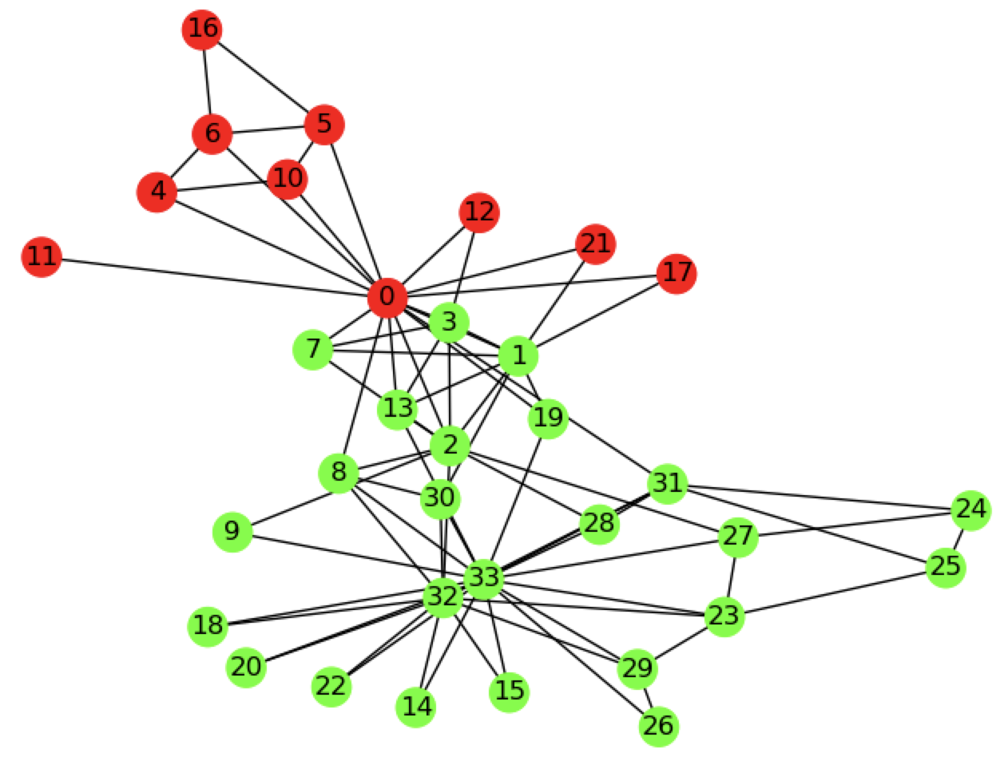

# Eigendecomposition (Spectral Decomposition)

The Karate Club graph with nodes colored by their designated cluster, as determined by Spectral Clustering, 
a clustering method based on Eigendecomposition. 

## Resources

https://machinelearningmastery.com/introduction-to-eigendecomposition-eigenvalues-and-eigenvectors/

http://people.csail.mit.edu/dsontag/courses/ml14/notes/Luxburg07_tutorial_spectral_clustering.pdf
